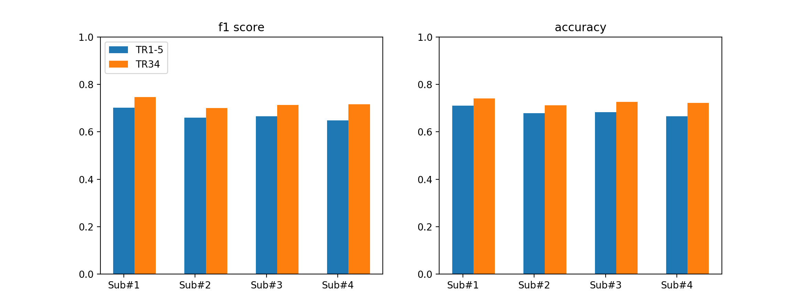
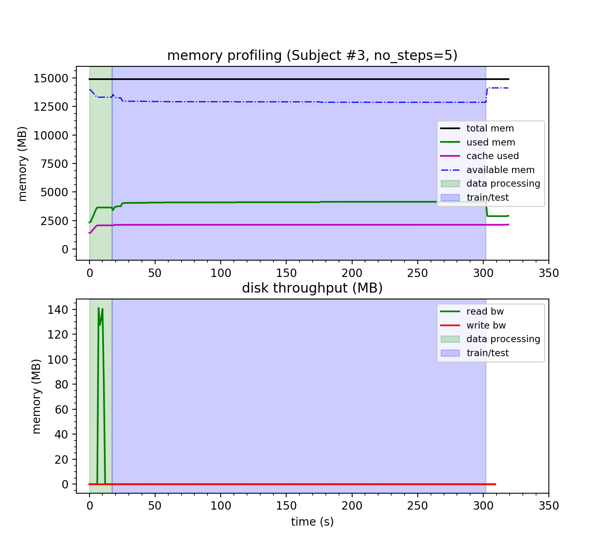

# Observed objects classification based on fMRI data

## **Abstract** 

Functional magnetic resonance imaging (fMRI) is one of the most widely used tools to study the neural underpinnings of  
human cognition. Meanwhile, in the field of neuroimaging, increasing spatial and temporal resolutions as well as 
larger sample sizes lead to a rapid increase in the amount of data that needs to be processed in atypical study.  
That is explosion of big imaging data highlights new challenges,such as data sharing, management, and processing, 
as well as reproducibility. In this project, we apply deep learning algorithm to classify objects observed by participants 
using fMRI data. In addition, we also address challenges with big data in classification problems using fMRI data. 
Particularly, we evaluate the performance of the algorithm on used data set in terms of classification metrics as well 
as used resources in data pre-processing, model training, validation and testing.

## **I. Introduction**

Neuroimaging is a relatively new field emerged with the development in neuroscience, psychology and computer science 
which works with brain images to capture and analyze the structures and functions in parts of neural system. 
Nowadays, due to the excellent resolution of fMRI data, the images containing visual objects can be effectively 
recognized using specific patterns derived from this data that are recorded when images are displayed on screen in 
front of the subjects [5].  
With the augmentation of fMRI datasets, increasing spatial and temporal resolutions as well as larger 
sample size lead to a rapid increase in the amount of data that needs to be processed in a typical study [1]. 
For more clarification, by 2015 the amount of acquired neuroimaging data alone, discounting header information 
and before more files are generated during data processing and statistical analysis, exceeded an average of 20GB 
per published research study [3]. However, as the richness of brain datasets continues to grow and the push to place it 
inaccessible repositories mounts, there are many issues to be considered on data processing, data transferring, storage, 
data analysis as well as data sharing [3]. Thus, the authors indicated it is safe to say that human neuroimaging is now, 
officially, a “big data” science [3].
Furthermore, in neuroimaging field in many applications, the problems that neuroscientists as well as 
computer scientists are currently tackling with are not only on algorithms, but also in resource optimization, 
reproducibility and fault-tolerance. 

In this project, we focus on resource problem usage in a deep learning application of fMRI data. 
We apply a deep learning algorithm to classify objects observed by different participants using fMRI data of brain scans. 
Subjects involved in the experiments were shown stimuli, which are different images of static objects as well as animated images. 
The fMRI scan data of their brains with different stimuli was recorded in a few time steps. 
Our input data is region of interest voxels (ROI) preprocessed and represented in vector form. 
Preprocessed ROI data of each participant is different in size as well as the number of features, which is the length of the vector. 
Thus, we train our model with different subject independently with different combinations of time steps and compare the results. 
Our goal is to have an idea of the improvements in the result with different data sizes, combinations of time steps 
as well as the possible bottleneck in neuroimaging application.

## **II. Materials and methods**. 

### **1.  Materials**
    
#### **1.1 Dataset**

The data we used is from BOLD5000 repository [2], a human functional MRI(fMRI) study. 
In this fMRI dataset, 4 participants were scanned and fMRI data was collected while subjects were asked whether they liked, disliked, or were neutral about the images. 
The images dataset are labeled with ImageNet super categories. 
From these categories, images are labeled as ”Living Animate”, “Living Inanimate”, “Objects”, “Food” or “Geography”. 
An example of label mapping is “Dog” to “Living Animate” and “Vehicle” to “Objects”. 

Features of fMRI data were represented by using ROIs including: ’LHPPA’, ’RHLOC’, ’LHLOC’, ’RHEarlyVis’, ’RHRSC’, ’RHOPA’,’RHPPA’, ’LHEarlyVis’, ’LHRSC’, ’LHOPA’. 
The data of the ROIs were extracted across the time-course of the trial presentation 
(TR1 = 0−2s,TR2 =2−4s,TR3=4−6s,TR4=6−8s,TR5=8−10s, TR34=4-8s).
Data sizes of the subjects are 425 MB, 573 MB, 783 MB and 416 MB respectively.
For the first 3 subjects, we have the same number of experiments, which is 1916, while the numbers of features are 1685, 2270, 3104.
For the last subject, the number of experiments is 1122 and the number of feature is 2787.
 

#### **1.2 Algorithm**

For the fMRI images classification problem with time-series data, we choose Long Short Term Memory (LSTM), which is 
based on recurrent neural network (RNN), as our classifier. 

Our motivation of applying RNNs is extracting higher-dimensional dependencies from sequential data. 
The main characteristic of RNN units is that they have connections not only between the adjacent layers, but also 
among themselves to capture information from previous inputs. 
Even though traditional RNNs can easily learn short-term dependencies; however,they have difficulties 
in learning long-term dynamics due to the vanishing and exploding gradient problems. The main advantage of LSTM is 
addressing the vanishing and exploding gradient problems by learning both long and short-term dependencies [4].

#### **1.3. Method**

The proposed network includes five LSTM layers and one dense layer. In all of the layers, we use _tanh_ 
activation function and set the dropout rate as 0.25. In the last dense layer, we apply _softmax_ activation function to 
predict the probability of each class. The model is trained with batch size of 50 and Adam as the optimizer.

The model is trained with different subjects independently since the number of features of each subject is different.
For each subject, the model is trained twice, once with 5 steps from TR1 to TR5 and once with 2 steps combined in TR34.
Three fourths of the data of each subject is used to train, the remaining is test data.
 
As the model is trained, we collect the information of CPU time, memory usage, disk throughput and cache used. 
Then we compare the results from different subject as well as results from the same subject with different time-steps used.

#### **1.4 Technologies, libraries and tools**

We choose **_tensorflow_**, **_keras_**, which is widely used for deep learning, to implement LSTM algorithm
and **_numpy_**, **_sklearn_** for data preprocessing. 
In order to obtain system information including memory used and disk throughput, we use **_atop_** linux command 
and **_collectl_**, a daemon software that collects system performance data.
We run our implementation a cloud VM on Compute Canada with Centos 7 OS, GenuineIntel 2.6GHz single core processor, 16GB of RAM and a HDD of 220GB.

### **3. Result**

 
Figure 1. F1 score and accuracy of the model trained with different subject data.

Model is first evaluated using multi-class f1 score and accuracy. Figure 1 describes the scores of the model trained with 
different subjects and different time steps, from TR1 to TR5 and TR34. A glance at the Figure 1 shows that with all subjects,
the scores of the model trained with TR34 steps are always higher than the scores of the model trained with all 5 steps 
from TR1 to TR5.

_**Table 1. Classification measurements report**_

| Subject | Data size | Experiments | Features | Used memory (TR1-5) | Used memory (TR34) |
|---------|-----------|-------------|----------|---------------------|--------------------|
| 1       | 425 MB    | 1916        | 1685     | 1164 MB             | 614 MB             |
| 2       | 573 MB    | 1916        | 2270     | 1383 MB             | 692 MB             |
| 3       | 783 MB    | 1916        | 3104     | 1811 MB             | 818 MB             |
| 4       | 416 MB    | 1122        | 2787     | 1233 MB             | 676 MB             |

========================================================================================================================

The model is trained with batch size of 50 applying Adam optimizer. After the model is trained, we use some metrics 
to measure the performance of our model. Table 1 shows the performance of model for test dataset in term of several 
metrics: precision, recall, f1-score and support. Our results show that the total accuracy equals to 0.7318. 
Furthermore, Table 2 illustrates the corresponding confusion matrix for the trained model on the test dataset.

_we will use ROC curve and confusion matrix to evaluate since this is a multi-class classification problem and 
the classes are imbalance._

Since we want to analyze the resource usage when the model is trained, we do not pre-process the data and train 
our model with the original data. By doing this, the training will be compute-intensive as well as memory consuming, 
and the impact of model and hyper-parameter choices can be more visible. This may make the bottlenecks to be identified 
and the improved more easily.

When it comes to resource profiling, we focus on CPU time, memory usage and cache used if possible as these usually are 
the possible bottlenecks to be optimized.

### **4. Discussion**

[Add discussion here, cut other sessions off]

## **References**

**[1]**  Roland N Boubela, Klaudius Kalcher, Wolfgang Huf, Christian Naˇsel, andEwald Moser.  Big data approaches for the analysis of large-scale fmri datausing  apache  spark  and  gpu  processing:  a  demonstration  on  resting-statefmri data from the human connectome project.Frontiers  in  neuroscience,9:492, 2016.

**[2]**  Nadine Chang,  John A Pyles,  Austin Marcus,  Abhinav Gupta,  Michael JTarr, and Elissa M Aminoff.  Bold5000, a public fmri dataset while viewing5000 visual images.Scientific data, 6(1):1–18, 2019.

**[3]**  John Darrell Van Horn and Arthur W Toga. Human neuroimaging as a “bigdata” science.Brain imaging and behavior, 8(2):323–331, 2014.

**[4]**  Guangyi  Zhang,  Vandad  Davoodnia,  Alireza  Sepas-Moghaddam,  YaoxueZhang, and Ali Etemad. Classification of hand movements from eeg using adeep attention-based lstm network.IEEE Sensors Journal, 2019.

**[5]**  Xiao Zheng, Wanzhong Chen, Yang You, Yun Jiang, Mingyang Li, and TaoZhang. Ensemble deep learning for automated visual classification using eegsignals.Pattern Recognition, 102:107147, 2020.
